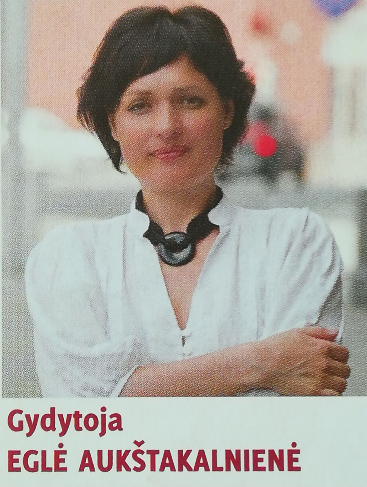

# Eglė Aukštakalnienė - gydytoja homeopatė

1994 baigė medicinos studijas Kauno Medicinos Akademijoje.
Įgijo medicinos gydytojo kvalifikaciją, bei bendros medicinos praktikos specialybę. Šeimos gydytojo praktinė patirtis apie 15 metų.

Studijavo homeopatiją Kauno Medicinos universitete.
Kijevo D.Popovos homeopatiniam centre, mokesi antihomotoksines terapijos studijose.

Homeopates naturopates darbo patirtis 10 metų. Atlieka vega testą,bei konsultuoja mitybos, gyvenimo būdo, psichoemocines korekcijos klausimais.
 

# Homeopatija

- Tai biologinė, natūrali medicina, kuri apima visa, kas paimta iš gamtos.

- Gydymo principas yra ne slopinti, o aktyvinti organizmo reakcijas, siekiant padėti organizmui harmonizuoti visas sistemas ir jas atvesti į pusiausvyrą.

- Homeopatija yra glaudžiai susijusi su organizmo valymu ir psichoemocinio lygio normalizavimu.

- Tai alternatyva cheminei medicinai, kurios gydymo principai yra visiškai kitokie.

# Vega testas

 – tai diagnostika, atliekama su labai jautria aparatūra, kuri **fiksuoja menkiausius organizmo funkcijos sutrikimus ląsteliniu lygmeniu**. Tyrimo metu vienoje rankoje laikomas pasyvus elektrodas, o kitoje aktyviu elektrodu matuojami sveiko taško fizikiniai parametrai ir stebimas organizmo atsakas į tam tikrus dirgiklius. Jeigu organizme yra pakitimų, kompiuterio ekrane pastebimas rezonansinis atsakas ir koreguojami šie  sutrikimai.

::: tip Vega testo metu galima nustatyti:

- ar žmogaus organizmas yra paveiktas žalingų geopatogenezinių zonų, jonizuojančios radiacijos, elektromagnetinių jėgos laukų (mobiliųjų telefonų, kompiuterių);
- ar organizme yra parazitų, bakterijų, virusų, toksinų, sunkiųjų metalų bei kitų medžiagų;
- ar organizmui trūksta vitaminų, mineralų, hormonų;
- ar sutrikęs rūgščių–šarmų balansas organizme, natūralusis pH;
- ar pasireiškia alergija;
- ar negresia susirgti onkologine liga;
- ar organizme yra mikro, makro auglių, gerybinių auglių, cistų;
- ar slypi ūmus ar lėtinis uždegimas;
- ar yra tinkami maisto produktai;
- ar yra psichoemocinių sutrikimų bei bioenergetinių organizmo disbalansų;
- ar gydytojo paskirti vaistai ligoniui yra tinkami ir kt.

:::